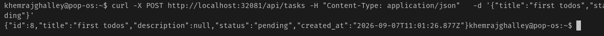
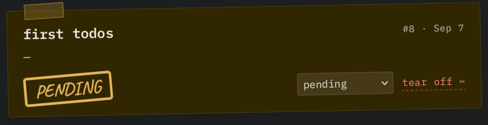
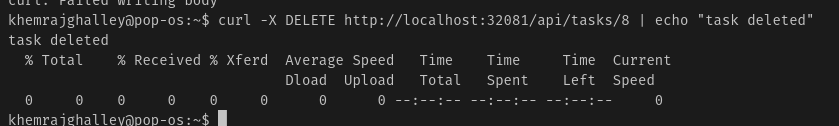
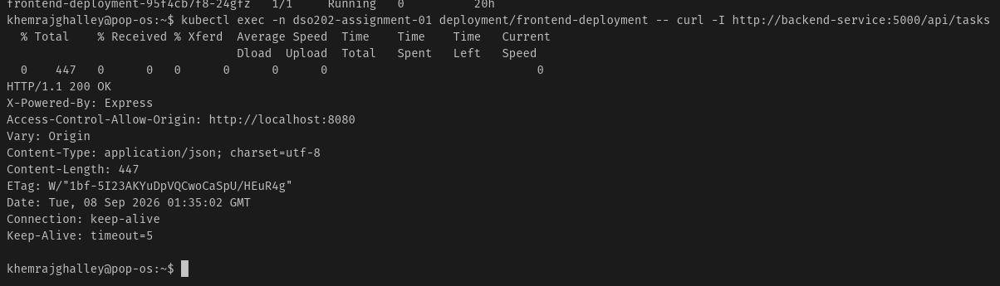
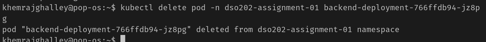
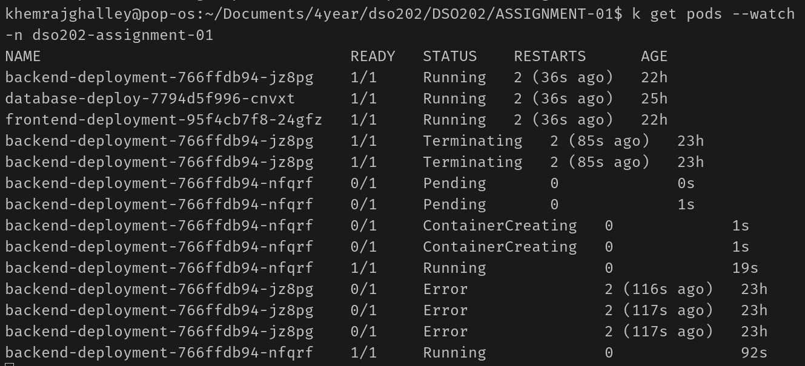
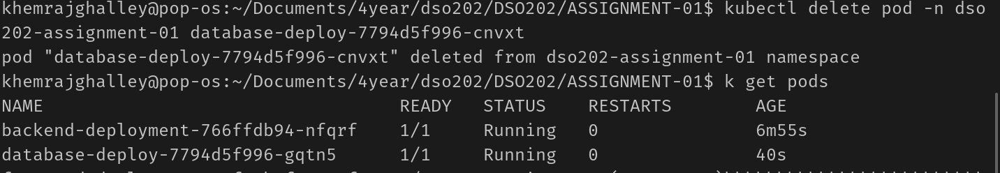
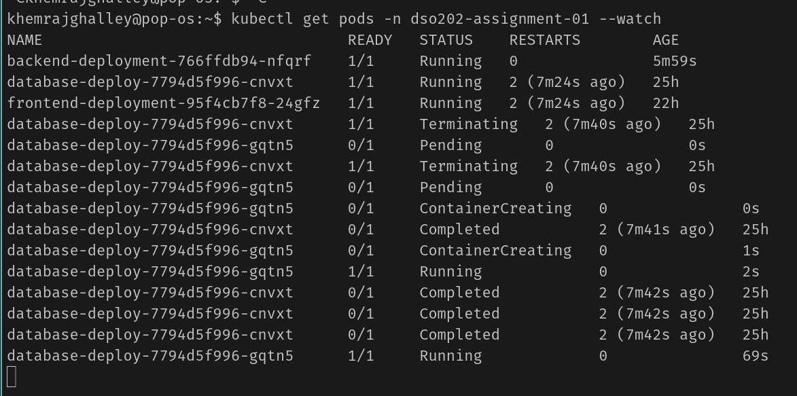
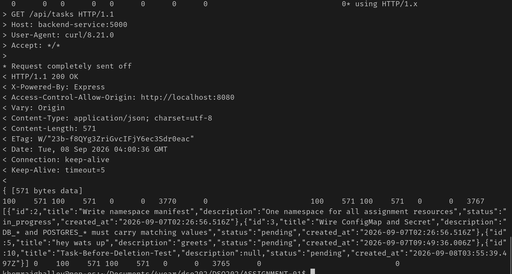
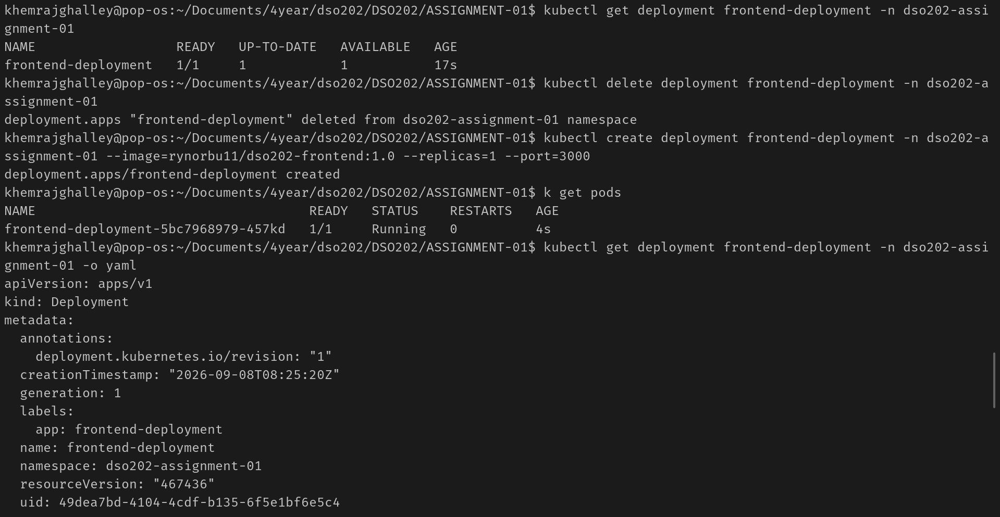

## DSO202 Assignment 1: Three-Tier Application Deployment on Kubernetes Cluster

### Aims/Objectives
- To deploy a stateless three-tier application on a Kubernetes cluster.
- To understand the architecture of a three-tier application and how to deploy it on Kubernetes.
- To learn about the various Kubernetes objects and their roles in managing application deployments.
- To understand the concepts of configuration, secrets, and security in Kubernetes.

K8s objects that helps in scheduling and running the Pods are:
- scheduler: Schedules the Pods to run on the available nodes based on the resources.
- controller-manager: Mantain the desired state of the cluster by managing the lifecycle of the pods and other objects(deployments, services, etc).
- kublet: It is responsible to start/stop the containers in the pods.
- Container runtime: It is responsible for running the containers in the pods.

To expose the presentation tier to the internet, API server will be used to create a Service of type LoadBalancer, which will provide an external IP address for accessing the frontend. For now, we are using port-forwarding to access the frontend application. 

Application tier will be exposed to the presentation tier using a Service, which will provide an internal IP address for communication between the two tiers. Same as the front tier it is also being exposed using port-forwarding for now.

Data tier will be exposed to the application tier using a Service of type ClusterIP, which will provide an internal IP address for communication between the two tiers. 

## Configuration, Secrets, and Security Architecture

**Production Remediation**: In the production standard, secrets should be encrypted at rest. This tells the database to automatically encrypt the data with a master key before writing it to the disk. If an attacker physically steals the hard drives from the data center, they will only see unreadable garbage text.

**Resource Allocation**

| Tier / Workload | CPU Request | CPU Limit | Memory Request | Memory Limit |
| :--- | :--- | :--- | :--- | :--- |
| Database | 250m | 500m | 256Mi | 512Mi |
| Backend  | 250m | 500m | 256Mi | 512Mi |
| Frontend | 250m | 500m | 256Mi | 512Mi |
| **Total Stack Footprint** | 750m | 1.5 CPU | 768Mi | 1.5Gi |
| **Hard Namespace Quota** | 2.0 CPU | 4.0 CPU | 2.0Gi | 4.0Gi |

**Justifications**

- I matched every container's baseline and spike settings directly to what we defined in our `limitrange.yaml`. This ensures everything boots up smoothly without throwing configuration errors, keeping the deployment clean and standardized.
- When you add up the baseline needs for all three tiers, the whole stack uses **`750m` CPU and `768Mi` RAM**. That sits at less than **40% of our total namespace quota**, which is great. It leaves plenty of open headroom so the app can absorb sudden traffic surges without crashing the cluster or hitting a resource ceiling.
- Setting strict upper limits ensures that if a database query lags or a front-end script loops out of control, it can't run away with all the memory on my laptop. This keeps the environment stable and prevents the database from getting abruptly killed by the system due to low memory.

**CRUD Operations**

**Service DNS resolution**

this picture shows the DNS resolution of the services in the cluster. The frontend service can resolve the backend service, and the backend service can resolve the database service. This is achieved by using the internal DNS provided by Kubernetes, which allows services to communicate with each other using their service names.

**Self-healing and data persistence**

these pictures show the self-healing and data persistence of the application. The  picture shows that when a pod is deleted, it is automatically recreated by the deployment controller.    

These picture shows that when a pod is deleted, the data in the database is still available because it is stored in a persistent volume.

**Declarative vs. imperative comparison**

when the frontend-deployment was deleted and recreated using a imperative command, the new pod didn't have the right label that the service was looking for. Because of this, the service couldn't find any pods to send traffic to, and the application stopped working. When again applied the original configuration file again, it fixed the labels and settings, and everything started working again. This shows that using configuration files (declarative) is better for managing applications in Kubernetes because it keeps all the settings and relationships between different parts of the app intact, while using commands (imperative) can lead to problems if you miss something.

**Reflection**

Hosting 3 tier application on the cluster was interesting and challenging. I learned how to create and manage deployments, services, and persistent volumes in K8s. I was more familier dealing with the deployment objects such as creating and deleting it. The main challenge was to make sure that the services are communicating with each other and the data is persistent even after the pods are deleted. Still I don't have clear idea of how to calculate the resource allocation for each tier based on the workload and traffic. 

