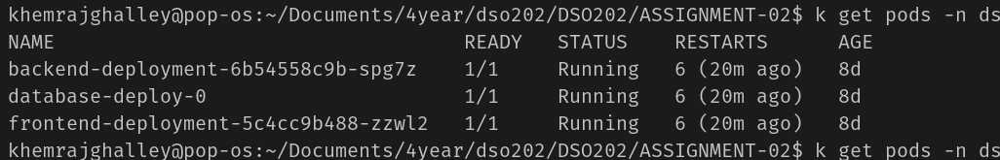
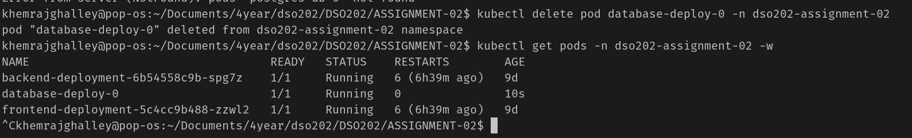
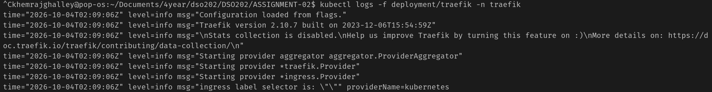
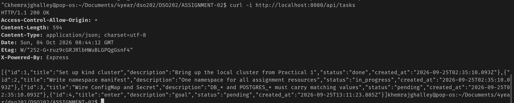

## DSO202 Assignment 2: Three-Tier Application Deployment on Kubernetes Cluster using StatefulSet and Ingress

**Aims/Objectives**
- To deploy a three-tier application on a k8s cluster
- Use StatefulSet to manage the stateful components of the application
- Use Ingress to expose the application to external traffic

What is StatefulSet?
It is kubernetes resources.
- StatefulSets provide the following features:
  - Stable, unique network identifiers for each pod
  - Persistent storage using PersistentVolumeClaims (PVCs)

What is Ingress?
- Ingress is a Kubernetes resource that manages external access to services within a cluster, typically HTTP
- Ingress can provide load balancing, SSL termination, and name-based virtual hosting.

Types of Ingress:
- Name based virtual hosting: Ingress can route traffic based on the host header in the HTTP request, allowing multiple domains to be served from a single IP address.
- Single service routing: Ingress can route traffic to a single service based on the path in the URL, allowing for more granular control over how traffic is directed within the cluster.
- Path Based routing: Ingress can route traffic to different services based on the path in the URL, allowing for more complex routing rules and better organization of services within the cluster.

What is Traefik?
- Traefik is a modern HTTP reverse proxy and load balancer written in Go.
- Strength of Traefik is that it automatically discovers the services and route the traffic to the appropriate service without manual intervention.

There are alternative to Traefik like Nginx, HAProxy, Envoy, etc.

**Implementation of Statefulset for Data Persistence**

The data tier is implemented using a StatefulSet, which provides stable network identities and persistent storage for each pod. Each pod in the StatefulSet has a unique identifier and is associated with a PersistentVolumeClaim (PVC) that ensures data persistence across pod restarts and rescheduling.


This is how the StatefulSet implementation looks like. It has stable identity it not like deployment pods which are ephemeral.

demonstration of stateful set 

this shows the statefulset works perfectly fine, it is working even after the pod is deleted and recreated, the data is still there.

**Implementation of Ingress for External Access**

Ingress is used to expose the application to external traffic. In this implementation, Traefik is used as the Ingress controller to manage the routing of traffic.



```
curl -i http://localhost:8080/api/tasks
```

this is how the Ingress implementation looks like. It has a rule to route the traffic to the appropriate service based on the path in the URL.

**Challenges**

It was challenging to set up the traefik ingress controller and configure the routing rules correctly. Additionally, ensuring that the StatefulSet was properly configured to maintain data persistence across pod restarts required careful attention to detail.

**Conclusion**
- StatefulSets solved our data problem by giving PostgreSQL a fixed identity and persistent storage that survives crashes.

- Traefik Ingress solved our networking problem by safely guiding web traffic from outside the cluster straight to the right internal services.