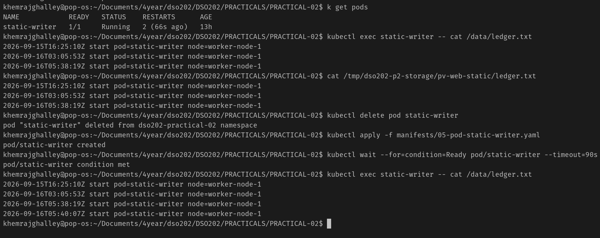
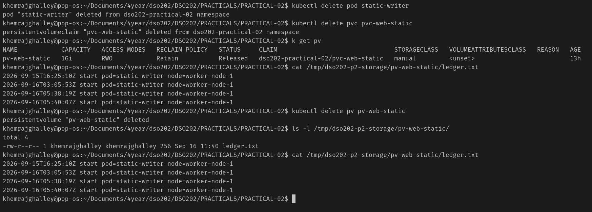
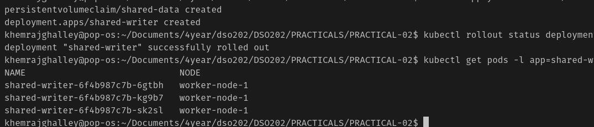
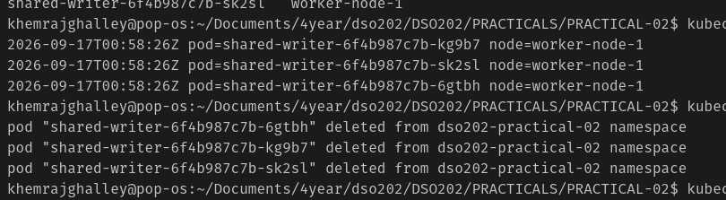
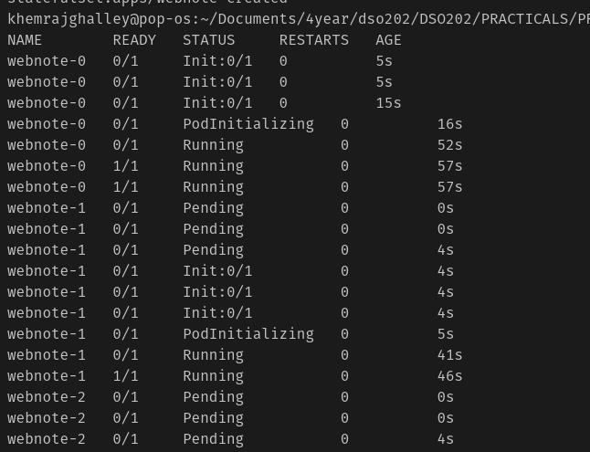
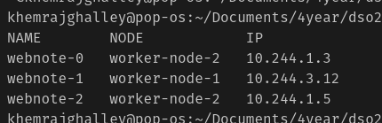
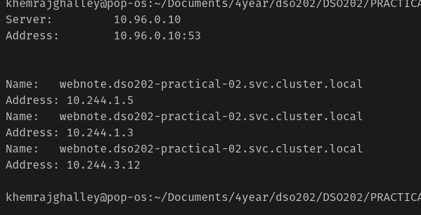

## Implementing Persistent Storage for a Stateful Application in Kubernetes 

**Aim/Objective:** 

StatefulSet will have a fixed name, a fixed DNS record, and its own volume that gets connected to it when restarted.

Volume: made available to the Pod.
- It is declared in the Pod specification
- and mounted at a path in a container at a path.

emptyDir: Temporary directory
- created when a Pod is assigned to a Node
- exists as long as that Pod is running on that Node

hostPath: Pre-existing file or directory on the host machine is exposed to the Pod.

PersistentVolume (PV): A piece of storage in the cluster that has been provisioned by an administrator or dynamically provisioned using Storage Classes.

PersistentVolumeClaim (PVC): A request for storage by a user. It is similar to a Pod. Pods consume node resources and PVCs consume PV resources.

add note here

**Prove the volume outlives the Pod**

**Delete the claim and observe Released**

Deleting the PV deleted an entry in the Kubernetes API. It did not delete any data. That distinction between the object and the storage it describes is the most commonly examined point in this stage.

### Dynamic Provisioning, StorageClasses, and Two Uncomfortable Truths

**Why a Deployment Cannot Own State**

The volume decided where the Pods could run. All three copies of the Pod ended up on the same machine, even though the Deployment didn't say which machine to use. This happened because the volume was tied to a specific machine, so the Pods couldn't move to another machine. The scheduler lost some of its flexibility because of this storage choice.

The Deployment created three copies of the Pod, but they all shared the same storage volume. This means that all three Pods were trying to write to the same file on that volume. While this is okay for a stateless web server, it can cause problems for a database because if multiple database processes try to write to the same data at the same time, it can corrupt the data. The Deployment doesn't have a way to give each Pod its own separate storage, which is why this issue occurs.

When we use a Deployment in Kubernetes, each time a Pod is restarted or replaced, it gets a new name. This means that there is no consistent way to identify a specific replica of your application. For applications like databases that need to communicate with each other, this can be a problem because they rely on being able to find and connect to the same instance of the database even after it has been restarted. Without a stable identity for each replica, it becomes difficult for the application to maintain its state and function correctly.

**StatefulSets and Stable Identity**

This step provides a fixed name, a private volume, a resolvable address, and a defined order.

It creats pod in sequence manner, and it will not create the next pod until the previous one is running and ready. It also ensures that each pod has a unique identity and stable network identity, which is important for stateful applications.

In simple words, when we restart the Pod, its name stays the same, and it reconnects to the same storage volume. The storage volume is not recreated; it remains the same, which is why it is older than the Pod. The creation date of the volume shows that it was not made again. However, the IP address of the Pod changes when it restarts, which is why applications should use the DNS name to connect instead of relying on the IP address.

