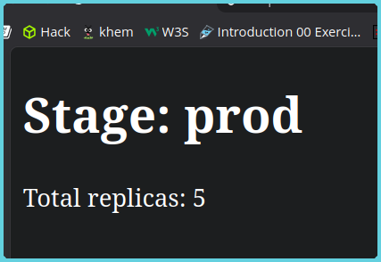
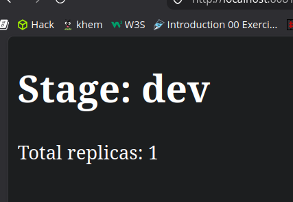

## Environment-Specific Configuration with Kustomize on Kind

**Aims/Objectives:**
- To understand how to use Kustomize for different stages of deployment (development, staging, production) in a Kubernetes environment.
- Apply Kustomize overlays to manage environment-specific configurations effectively.
- Inject the html file into the Nginx container using ConfigMap.

Standard Folder Structure:
```
├── base
│   ├── deployment.yaml
│   ├── service.yaml
│   └── kustomization.yaml
│   └── index.html
├── overlays
│   ├── dev
│   │   ├── kustomization.yaml
│   │   └── configmap.yaml
│   ├── staging
│   │   ├── kustomization.yaml
│   │   └── configmap.yaml
│   └── prod
│       ├── kustomization.yaml
│       └── configmap.yaml
```

Results 




Conclusion
In this practical, I have successfully applied the concepts of Kustomize to manage different stage of deployment in the Kubernetes. The main objective of this practical was to apply the concepts of injecting the html file into the Nginx container using ConfigMap. Which i have successfully done. Kustomize not only work on the editing manifest files but also helps editing the code inside the container. This practical has helped me to understand the concepts of Kustomize and how it can be used to manage different stage of deployment in the Kubernetes.


