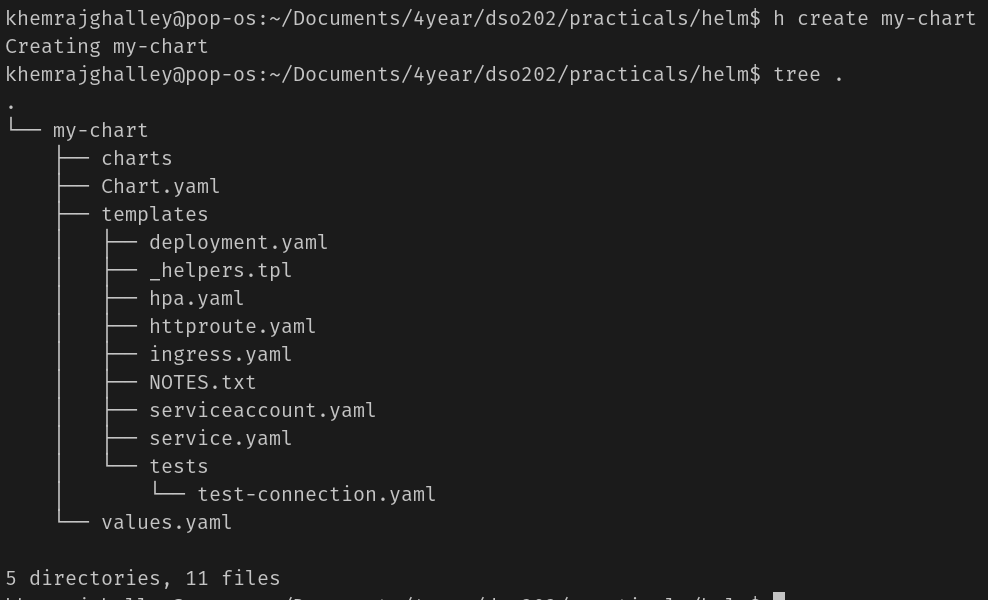
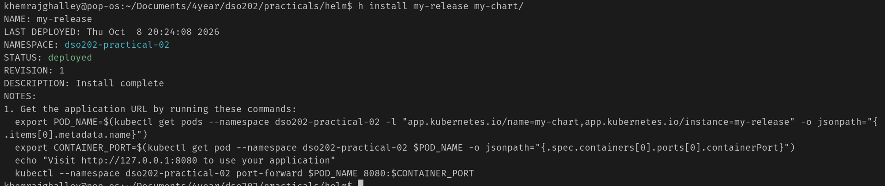
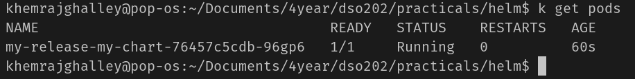
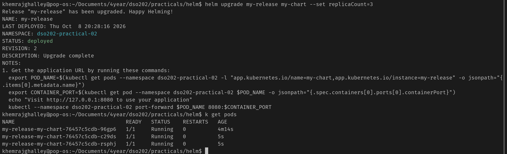
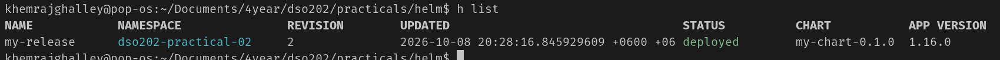
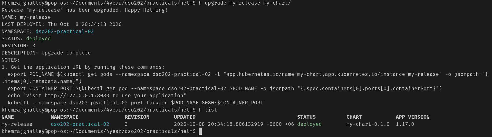
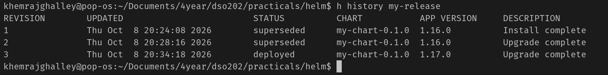
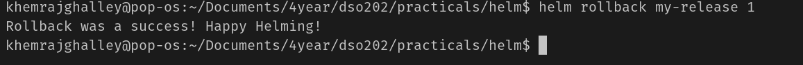

### Kubernetes with Helm-Practical-06

**What is Helm?**
- Helm is a package manager for Kubernetes that allows you to define, install, and manage Kubernetes applications. It simplifies the deployment of complex applications by using charts, which are packages of pre-configured Kubernetes resources.

let's get directly into creating helm chart

**Create a Helm Chart**
```
helm create my-chart
``` 


Lets understand the structure of the helm chart created
- `Chart.yaml`: This file contains metadata about the chart, such as its name, version
- `values.yaml`: This file contains default configuration values for the chart. It can be overwritten by providing a custom values file during installation
- `templates/`: This directory contains Kubernetes manifest templates that will be rendered into actual Kubernetes resources

**Deploy Your Helm Chart**

we are done with creating our chart now its time to deploy our chart, for now I am not customizing anithing. I will be deploying default helm chart to the k8s cluster. 

```
helm install my-release my-chart
```




The pos is running, which is created by the helm chart

Lets replicate it to 3 pods, for that we need to edit the values.yaml file and change the replica count to 3

```
replicaCount: 3
```
or we can do it using imperative way

```
helm upgrade my-release my-chart --set replicaCount=3
```


Lets try to upgrade the app-version and try to do rollback.

right now the app version is 1.16.0, lets upgrade it to 1.17.0

Now lets rollback to previous version


we have 3 revision in total, if i want to rollback to previous version i can use the following command

```
helm rollback my-release 1
```


We can even package our chart and share it with others, for that we can use the following command

```
helm package my-chart
```

Happy Helming!

These are the basic steps to create, deploy, upgrade, and rollback a Helm chart in Kubernetes. Helm makes it easier to manage complex applications and their configurations in a Kubernetes environment.