# DSO202 — Practical 1 Report

## Setting Up a Local Kubernetes Cluster with kind, and Deploying First Workloads

### Objectives

The main objective of this practical is to setup a local Kubernetes cluster using kind and interact with it by deploying workloads using kubectl. The practical also focuses on understanding the concepts of namespaces, resource quotas, limit ranges, pods, deployments, and services.

**Setting Up kind**

``` 
kind create cluster --config cluster/kind-cluster.yaml
 ```

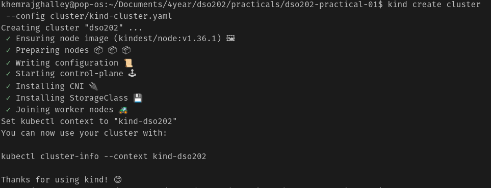

Three nodes running.


### **Namespaces, Resource Quotas, and Limit Ranges**

**Namespaces** are a logical partition of cluster resources. It allows us to create multiple virtual clusters within the same physical cluster. Most importantly, it allows us to separate resources and workloads for different teams or projects.

**Resource Quotas** are the amount of resources that can be used by a namespace. It is just to limit the resources for a namespace and it prevents a single namespace from using all the resources in the cluster. 

**Limit Ranges** are the minimum and maximum amount of resources that a container or pod can use. It prevents a single container or pods from using all the recources allocated for a namespace.

There are two ways to configure namespaces or any K8s objects. One is using the CLI and the other is using YAML files.

```
kubectl create namespace <namespace-name>
``` 
```
kubectl apply -f manifests/00-namespace.yaml
```

 


The picture below show the resources allocated for namespace(dso202-practical). This was configured using declerative method.
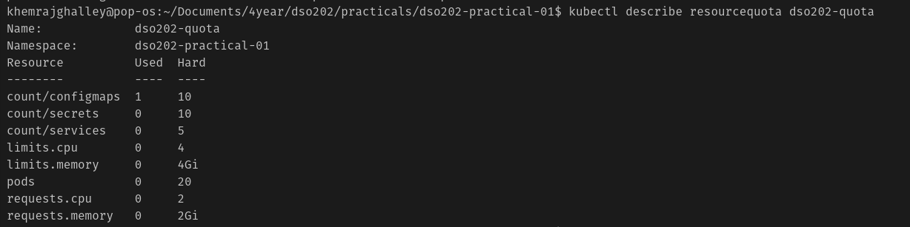

it shows the minimum and maximum amount of resources that a container can use. It also shows the default request and limit for a container.
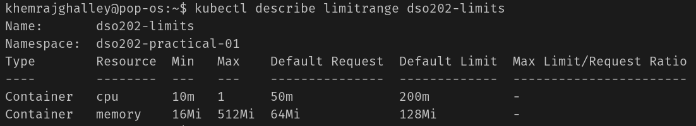

**Pods** are the smallest deployable units in K8s. A pod is a group of one or more containers that share the same network namespace. 

command to create a pod:

```
kubectl run -n <namespace-name> <pod-name> --image=<image-name>
```
```
kubectl apply -f manifests/01-pod.yaml
``` 

Interacting with the pod:

```
kubectl get pods -n <namespace-name>
```
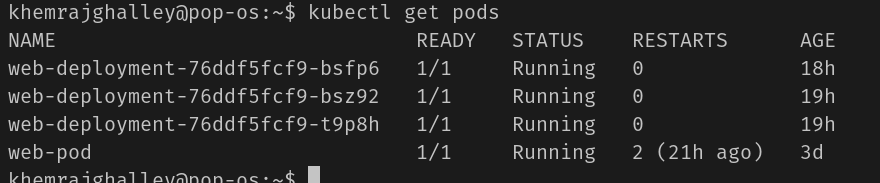
```
kubectl describe pod -n <namespace-name> <pod-name>
``` 
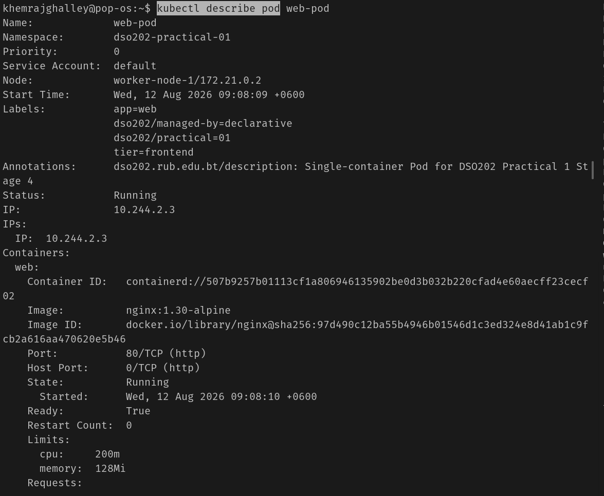

The best practice to always refer to the pod using its name and namespace. This is because there can be multiple pods with the same name in different namespaces.

### Deployments

It is like a manager for our pods. It ensures that the desired number of pods are running and available. It also allows us to update our pods without downtime. It focus on which version of app should be running. It also allows us to rollback to previous versions of our app if something goes wrong.

**Replicas** are the number of copies of a pod that we want to run. It only look after the number of pods running, it ensures that mentioned number of pods are running. If one of the pods goes down, it will create a new pod to replace it.

To create a deployment, we can use the following command:

```
kubectl create deployment -n <namespace-name> <deployment-name> --image=<image-name>
```
```
kubectl apply -f <manifests-file>
```

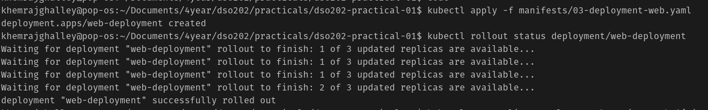

commands to delete a deployment:

```
kubectl delete deployment -n <namespace-name> <deployment-name> 
``` 

### Scaling

It is the process of increasing or decreasing the number of replicas of a deployment.

```
kubectl scale deployment -n <namespace-name> <deployment-name> --replicas=<number-of-replicas>
``` 

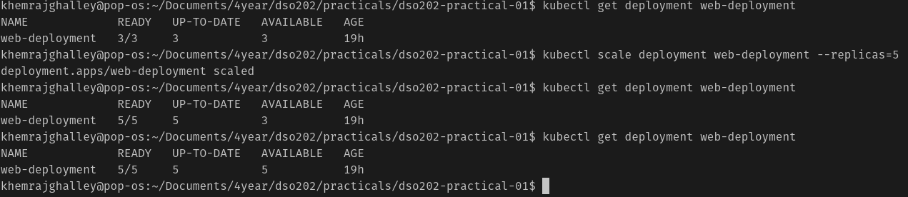

Declarative method to scale a deployment:

```
kubectl apply -f manifests/02-deployment.yaml
```
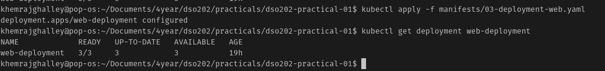

### Rolling update and rollback

Rolling updates gradually replace the old version of app with the new version without downtime. It ensures that the desired number of pods are running and available during the update process.

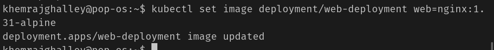

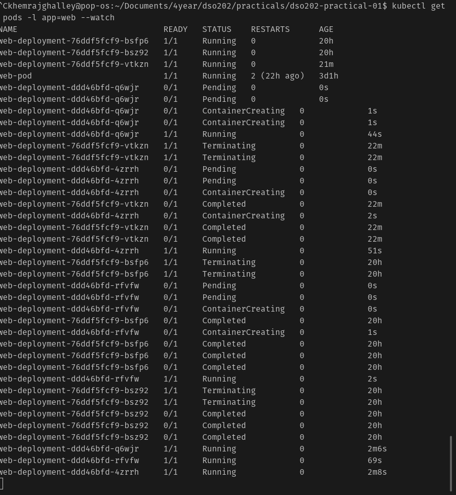

Rollback is the process of restoring the previous version of app. This process is useful when the new version of app has some issues. It allows us to quickly restore the previous version of app without downtime.

```
kubectl rollout undo deployment -n <namespace-name> <deployment-name>
```

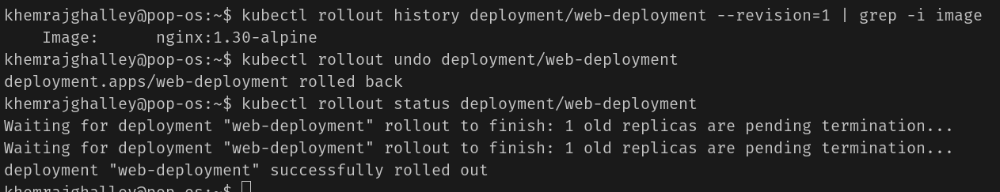

### Services

It is exposing pods outside the cluster. It can be accessed using IP address of cluster and port. 

Here we can only access the service within the namespace. To access the service outside the namespace, we need to create a service of type NodePort. 

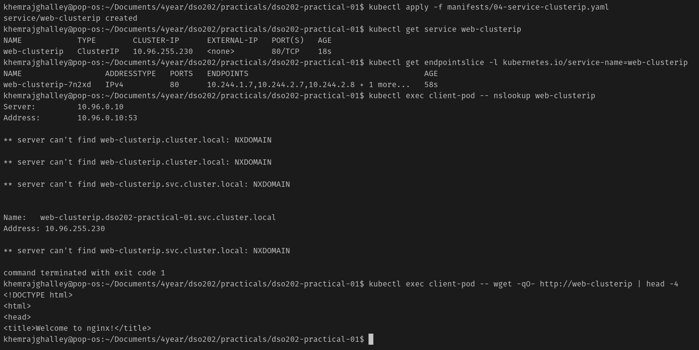

### NodePort

It is a type of service that exposes the pods on the same port on each node in the cluster. It allows us to access the pods using the IP address of any node in the cluster and the port number.

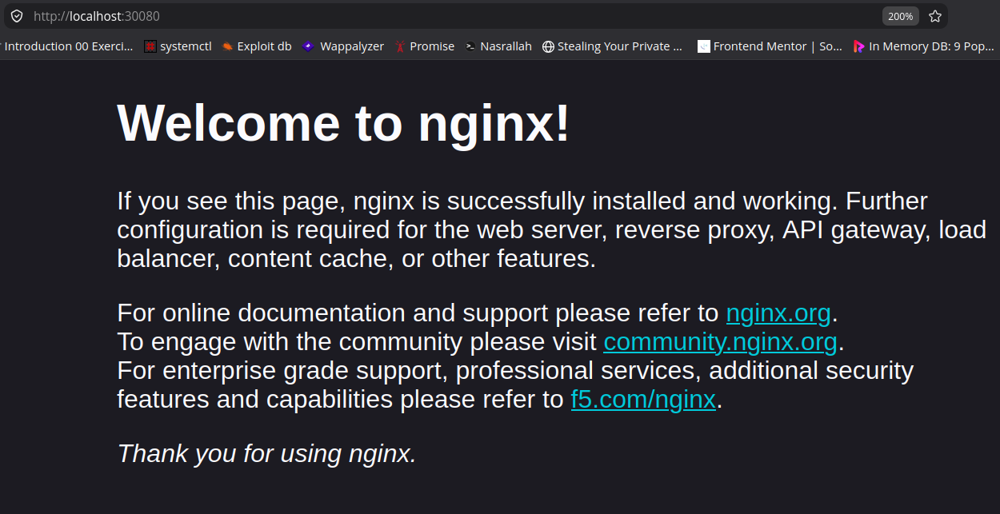

Since cluster itself is running as a container we cannot expose the service outside the cluster. To access the service outside the cluster, we need to use port forwarding for now. 

**Reflection**

In this practical, I learned how to setup a local K8s cluster using kind and interact with kubectl. I also learned how to create namespaces, resource quotas, limit ranges, pods, deployments, and services. At first most confusing part was to understand the namespaces, because it didn't exist in the K8s architecture. But after reading the documentation and watching some videos, I understood the concept of namespaces and how it is used to separate resources and workloads for different namespaces. The most interesting part was scaling the pods, it was interesting to see how the K8s manages makes the app available and running without downtime. For this practical, I mostly focused on the basics concepts all the objects in K8s. It is understanble on the surface level but once we dive deeper, it makes some sense but it is still hard to keep all the things in mind. I think the best way to learn K8s is to practice and experiment with different objects and their configurations.

**References**
- https://kubernetes.io/docs/tutorials/kubernetes-basics/expose/expose-intro/

- https://medium.com/@Ibraheemcisse/kubernetes-namespaces-my-journey-from-confusion-to-clarity-8a721f28582a


